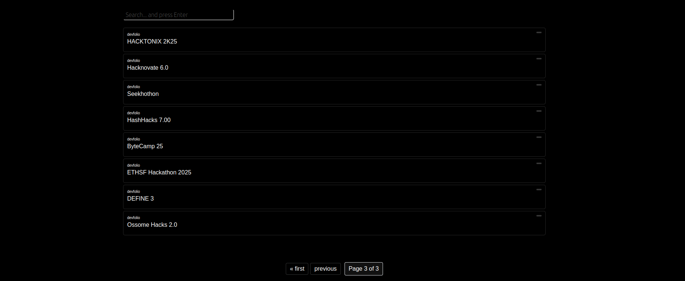

# Hackleague

# Search functionality


## Pagination




# **Running the Hackleague Django App**

This guide will help you set up and run the Hackleague Django application.

## **Prerequisites**

Ensure you have the following installed:
- Python (>=3.8)
- pip (Python package manager)
- virtualenv (for creating virtual environments)
- Git (optional, for version control)

## **Setup Instructions**

### **1. Clone the Repository**
```sh
# Replace with your actual repository URL
git clone https://github.com/siesto1elemento/Hackleague.git
cd Hackleague
```

### **2. Create and Activate a Virtual Environment**
```sh
# Create a virtual environment named 'venv'
python3 -m venv venv

# Activate the virtual environment
source venv/bin/activate
```

### **3. Install Dependencies**
```sh
pip install -r requirements.txt
```

### **4. Apply Migrations**
```sh
python manage.py migrate
```

### **5. Create a Superuser (Optional, for Admin Access)**
```sh
python manage.py createsuperuser
